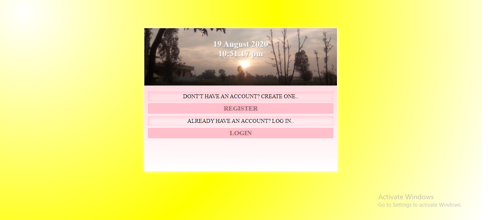
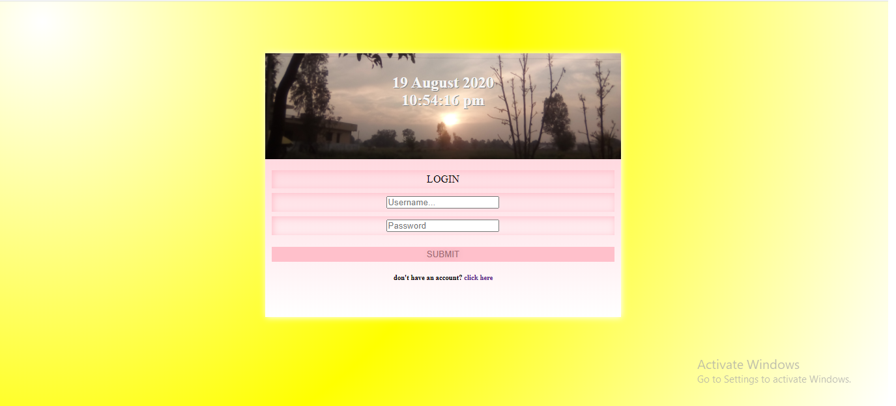
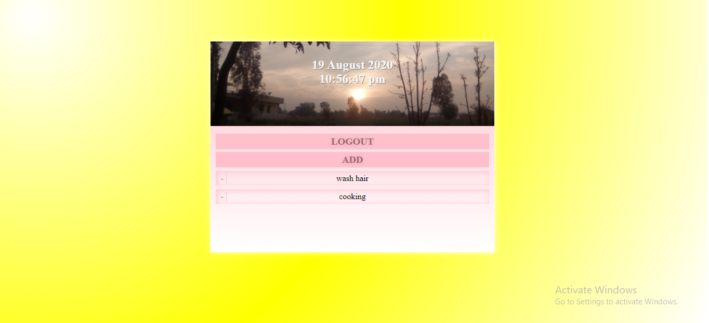

<h1 align="center">ToDo App</h1>
A basic todo web application with Django at backend and HTML and CSS at frontend. 
In this web app you can register your account.

upon successful registration you will be redirected to the log on page.

In your page you can add or delete your work to be done aling with the date and time.

on deleting, it will ask you to confirm the action

If you cancel, the deletion operation will be terminated, but if you proceed the selected task will be deleted

